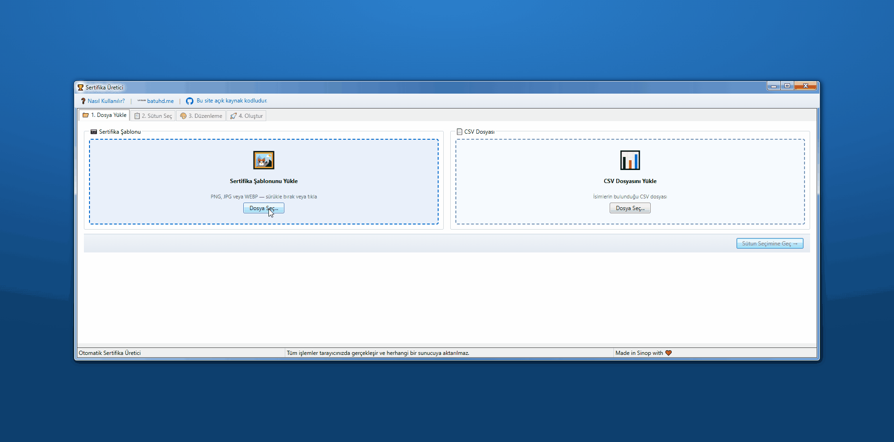
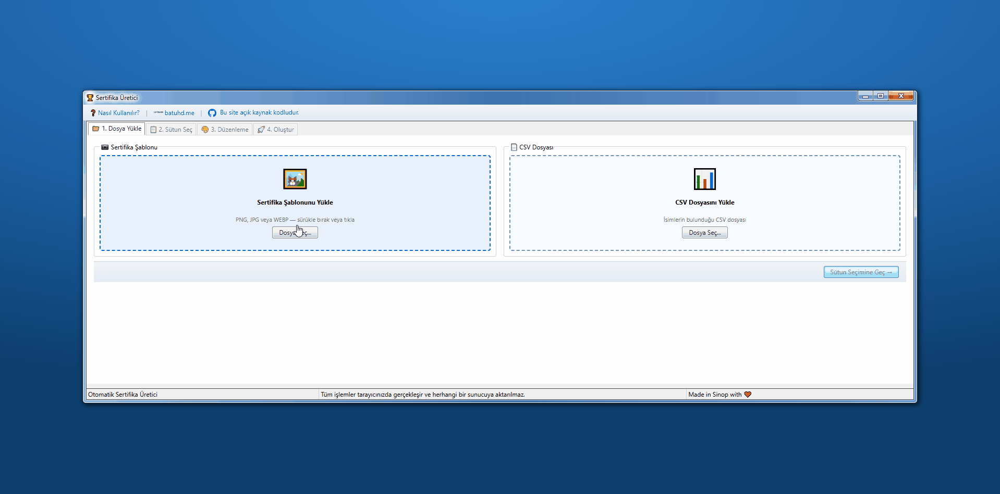

# 🏅 Otomatik Sertifika Üretici




CSV dosyasından isimleri alarak toplu sertifika üreten ücretsiz online araç. Tüm işlemler tamamen tarayıcıda gerçekleşir, hiçbir veri sunucuya gönderilmez.

## ✨ Özellikler

- **Toplu Üretim** - CSV'deki tüm isimler için tek tıkla sertifika oluşturma
- **Görsel Konum Editörü** - Sertifika üzerinde tıkla, sürükle veya köşe tutamaçlarıyla yeniden boyutlandır
- **20+ Yazı Tipi** - Google Fonts: serif, sans-serif, el yazısı seçenekleri
- **Tam Tipografi Kontrolü** - Boyut, kalınlık, renk, hizalama, harf dönüşümü, ön ek
- **Akıllı Taşma Algılama** - Kutuya sığmayan isimler otomatik olarak küçültülür, uyarı gösterilir
- **PNG / JPEG Çıktı** - Seçtiğiniz formatta ZIP olarak indirilir
- **Zoom & Nudge** - Tuval üzerinde hassas konumlandırma için zoom ve yön tuşları
- **Gizlilik Odaklı** - Tüm işlemler tarayıcıda gerçekleşir, sunucuya hiçbir veri gönderilmez

## 🚀 Kullanım

1. **Sertifika şablonunu yükle** - PNG, JPG veya WEBP formatında
2. **CSV dosyasını yükle** - İsimlerin bulunduğu dosya
3. **Sütun seç** - Hangi sütunların birleştirileceğini belirle
4. **Konumu ayarla** - Sertifika üzerinde tıkla, sürükle veya ince ayar butonlarını kullan
5. **Yazı ayarlarını yap** - Font, boyut, renk, hizalama
6. **Oluştur ve indir** - Tüm sertifikalar ZIP olarak indirilir

## 🛠️ Geliştirme

```bash
# Bağımlılıkları yükle
npm install

# Geliştirme sunucusunu başlat
npm run dev

# Üretim için derle
npm run build

# Derlemeyi önizle
npm run preview
```

## 📦 Teknolojiler

| Kütüphane                                  | Kullanım            |
| ------------------------------------------ | ------------------- |
| [Vite](https://vitejs.dev/)                | Build aracı         |
| [PapaParse](https://www.papaparse.com/)    | CSV ayrıştırma      |
| [JSZip](https://stuk.github.io/jszip/)     | ZIP oluşturma       |
| [7.css](https://khang-nd.github.io/7.css/) | Windows 7 UI teması |
| [Google Fonts](https://fonts.google.com/)  | Yazı tipleri        |

## 📄 Lisans

MIT
